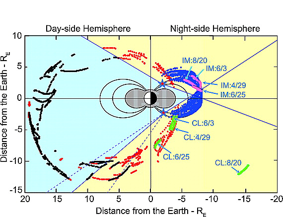

```{python}
# Need to be hidden
# 1. Importing Libraries
import sys
from pathlib import Path
import plotly.io as pio
import plotly.express as px

# 2. Setting project paths
project_root = Path.cwd()
sys.path.append(str(project_root))

# Define standard data subdirectories for easy access later
RAW_DATA_DIR = project_root / "data" / "raw"
PROCESSED_DATA_DIR = project_root / "data" / "processed"
ASSETS_DIR = project_root / "assets" / "3D_Objects"
IMAGE_DIR = project_root / "assets"

def visualise_3D(plot_save_path):
    path = Path(plot_save_path)
    if path.exists():
        fig = pio.read_json(str(path))

        # Reset layout to fit a slide frame perfectly
        fig.update_layout(
            margin=dict(l=0, r=0, t=30, b=0),
            autosize=True,
            # This ensures the 3D scene fills the available div
            scene=dict(aspectmode="data", camera=dict(eye=dict(x=1.5, y=1.5, z=1.5))),
        )
        return fig  # Return the object instead of calling .show()
    else:
        return f"File not found: {path}"
```

## Introduction {.smaller}

<!-- Arrange content into columns of varying widths: @Morioka2011 [^1] -->

::: columns
<!-- Column 1 -->
::: {.column width="45%"}

* **Morioka et al. [-@Morioka2011]** defined the 2D boundaries of where AKR can be seen (illumination) vs. where it is blocked (shadow).
* **Fogg et al. [-@Fogg2022]** isolated a decade of specific "burst" events from complex NASA Wind/WAVES radio data.
* **Our Project** integrates these datasets into a **3D Python tool**, allowing users to predict AKR visibility from any point in space.
:::
<!-- Gap -->
::: {.column width="3%"}
:::
<!-- Column 3 -->
::: {.column width="52%"}

:::
:::


## Development Roadmap {.smaller scrollable="false"}
::: {.task-list}
- [x] **Data Ingestion**: Standardised the AKR burst catalog processing pipeline.
- [x] **3D Coordinate Framework**: Functions to generate spatial grids for x/y/z ($R_E$) (Cartesian) and MLT/Radial/Lat (Spherical) systems.
- [ ] **AKR Feature Calculation**: generalised functions to calculate,
  - [x] Number of bursts
  - [x] Observation time
  - [x] Residence time
  - [ ] Normalised observation time
- [ ] **HPC Scaling**: Execute the function on complete dataset on high-performance compute clusters.
- [ ] **Probabilistic Modeling**: Develop the predictive engine for 3D AKR visibility.
- [ ] **TFCat Support**: Integrate standard support for processing TFCat file processing.
- [ ] **Deployment**: Publish the `akr_3d_map` Python package and short technical paper.
:::

## How the code work
::: columns
<!-- Column 1 -->
::: {.column width="48%"}
#### Cartesian
```{python}
# | eval: false
# | echo: true
from akr_3d_map.grid_3d import Cartesian

# 3. Performing analysis and generating plot
cart = (
    Cartesian()
    .create_grid()
    .add_burst_count(wind_data, coord_colnames=("x_gse", "y_gse", "z_gse"))
    .add_observation_time(wind_data, coord_colnames=("LT_gse", "radius", "lat_gse"))
    .add_residence_time(residence_data, coord_colnames=("x_gse", "y_gse", "z_gse"))
    .plot_3d(
        variable="burst_count |residence_time | residence_time",
        path="plot_save_path",
        show_earth=True,
        earth_image_path_str="/temp.jpg",
        show_sun=False,
    )
)
```
:::
<!-- Gap -->
::: {.column width="4%"}
:::
<!-- Column 3 -->
::: {.column width="48%"}
#### LTRMlat
```{python}
# | eval: false
# | echo: true
# | code-line-numbers: "1,4,5"
from akr_3d_map.grid_3d import LTRMLat

# 3. Performing analysis and generating plot
ltrmlat = (
    LTRMLat()
    .create_grid()
    .add_burst_count(wind_data, coord_colnames=("x_gse", "y_gse", "z_gse"))
    .add_observation_time(wind_data, coord_colnames=("LT_gse", "radius", "lat_gse"))
    .add_residence_time(residence_data, coord_colnames=("x_gse", "y_gse", "z_gse"))
    .plot_3d(
        variable="burst_count |residence_time | residence_time",
        path="plot_save_path",
        show_earth=True,
        earth_image_path_str="/temp.jpg",
        show_sun=False,
    )
)
```
:::
:::

## Cartesian: 3D Plots for Burst Count
```{python}
# | echo: false
# | eval: true
import plotly.io as pio

visualise_3D(plot_save_path="assets/3D_Objects/cartesian_grid_with_burst_counts.json")
```

## LTRMlat: 3D Plots for Burst Count
```{python}
# | echo: false
# | eval: true
visualise_3D(plot_save_path="assets/3D_Objects/LTRMlat_grid_with_burst_counts.json")
```

## Other plots are at:
[Documentation Page](https://somu796.github.io/AKR_3D_map/#burst-counts)

## Refrences

